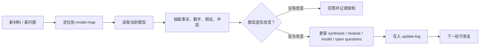
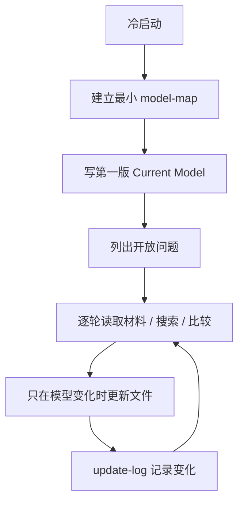

# Progressive Investment Research

一个用于长期研究的 agent skill：把零散材料、判断、数字和开放问题维护成一个可恢复、可审计、可持续推进的研究模型。

[English README](README.en.md)

## 它是什么

很多研究不是一次性报告，而是一个持续演化的判断系统。你今天读了一份材料，明天补了几个数字，下周又发现原判断有冲突。如果这些变化只散落在聊天记录、搜索结果和临时文档里，下一次接续时就会重新迷路。

Progressive Investment Research 把研究维护成一个 dossier：

- `current-synthesis.md` 记录当前模型，让人和 agent 都能快速恢复状态。
- `model-map.md` 记录研究边界、分析轴、模块和开放问题。
- `modules/` 保存证据模块、概念框架、审计记录和关键 registry。
- `models/` 保存公式、参数、情景和可复算推理。
- `open-questions.md` 区分仍需推进的问题、已暂时关闭的问题和 watchlist。
- `update-log.md` 记录模型为什么改变。

它适合投资研究、行业研究、公司研究、技术主题研究，以及任何会持续更新的复杂问题。

## 它怎么运行



核心原则很简单：不要把所有东西写成一篇越来越长的报告，而是把研究拆成可恢复的状态、可追溯的证据和可复算的模型。

## 建立一个研究工作区

安装后，在你希望保存研究 dossier 的位置运行：

```powershell
python scripts/scaffold_dossier.py "./my-topic" --title "My Topic"
```

这会生成一个最小工作区：

```text
my-topic/
  context.md
  current-synthesis.md
  model-map.md
  open-questions.md
  update-log.md
  modules/
```

然后让 agent 从这个目录开始工作，例如：

```text
使用 progressive-investment-research，接续 ./my-topic。
先读 current-synthesis.md 和 model-map.md，告诉我当前模型是什么，以及下一步最值得推进的问题。
```

验证工作区结构：

```powershell
python scripts/validate_dossier.py "./my-topic" --strict
```

打印当前索引：

```powershell
python scripts/regenerate_index.py "./my-topic" --stdout
```

## 推荐工作流



常见任务可以这样交给 agent：

- “接续这个 dossier，先恢复当前模型。”
- “吸收这份材料，但不要直接改结论；先告诉我它会影响哪个模块。”
- “把这个数字加入模型前，检查来源、口径、时间和是否可复算。”
- “现在有哪些 active questions？哪些只是 monitor？”
- “这轮研究结束后，更新 Current Model 和 update-log。”

## 文件应该怎么用

| 文件 / 目录 | 用途 | 什么时候更新 |
| --- | --- | --- |
| `context.md` | 工作区入口、范围、接续协议 | 冷启动、范围改变、接续规则改变 |
| `current-synthesis.md` | 当前模型，人类恢复入口 | 结论或关键不确定性改变 |
| `model-map.md` | 研究边界、分析轴、模块地图 | 研究结构改变 |
| `open-questions.md` | active / monitor / watchlist 状态 | 问题状态改变 |
| `update-log.md` | 模型变化日志 | 每次实质更新后 |
| `modules/` | 证据、框架、审计、registry | 某个主题需要稳定承载 |
| `models/` | 计算模型、情景、公式 | 判断依赖数字、公式或敏感性 |
| `companies/` | 公司 watchlist cards | 研究进入公司级跟踪 |
| `data/` | canonical rows / CSV | 模型需要结构化数据 |
| `archive/` | 默认不读的历史材料 | 压缩 active surface 时 |

## 安装

把这个仓库复制到你的 agent skill/plugin 目录，或让 runtime 直接指向这个文件夹。

Codex 风格加载需要：

- `SKILL.md`
- `.codex-plugin/plugin.json`
- `references/`
- `templates/`
- `scripts/`

Claude 风格加载还包含：

- `.claude-plugin/plugin.json`
- `agents/`

## 依赖与 fallback

核心能力只要求 agent 能读写文件。`scripts/` 里的辅助脚本只依赖 Python 标准库。

外部搜索、浏览器、URL 抽取、PDF/Office 解析、AnySearch、web-access、markitdown 等都只是加速器。没有这些工具时，仍然可以继续研究：

1. 使用当前 runtime 可用的搜索、浏览或文件读取能力。
2. 在 Source Card 或模块里记录来源、权限状态和获取方式。
3. 把搜索摘要、二手材料和未复核数字先作为 source lead，不要直接写成模型事实。

## 示例

`fixtures/ai-industry-chain-mini/` 是一个去敏的 mini dossier，用来展示这个 skill 的工作方式。它不是投资建议，也不是完整研究数据库。

你可以让 agent 读取它：

```text
使用 progressive-investment-research，读取 fixtures/ai-industry-chain-mini。
请说明 Current Model、Model Map、Open Questions 分别承担什么职责。
```

## 测试

运行轻量 contract tests：

```powershell
python tests/test_contract.py
```

测试只使用 Python 标准库。

## License

MIT. See `LICENSE`.
